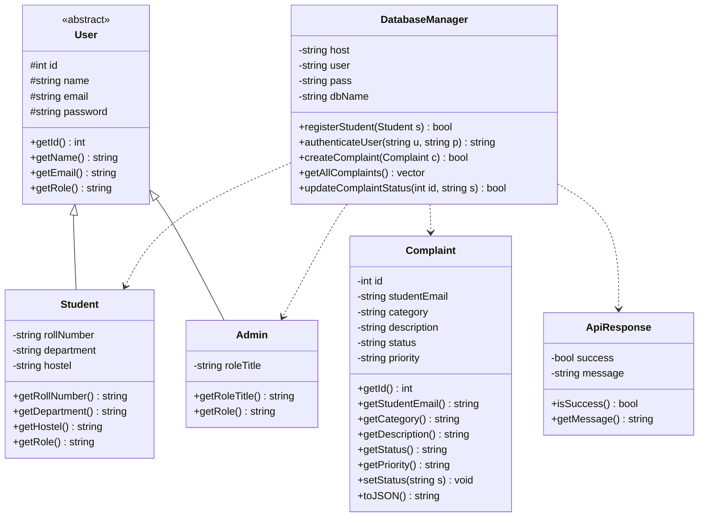
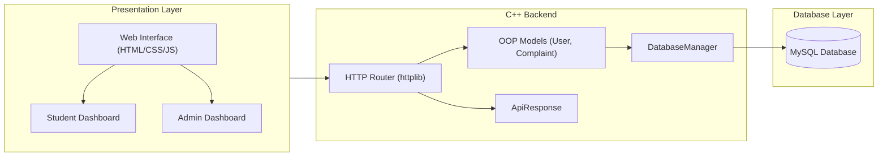
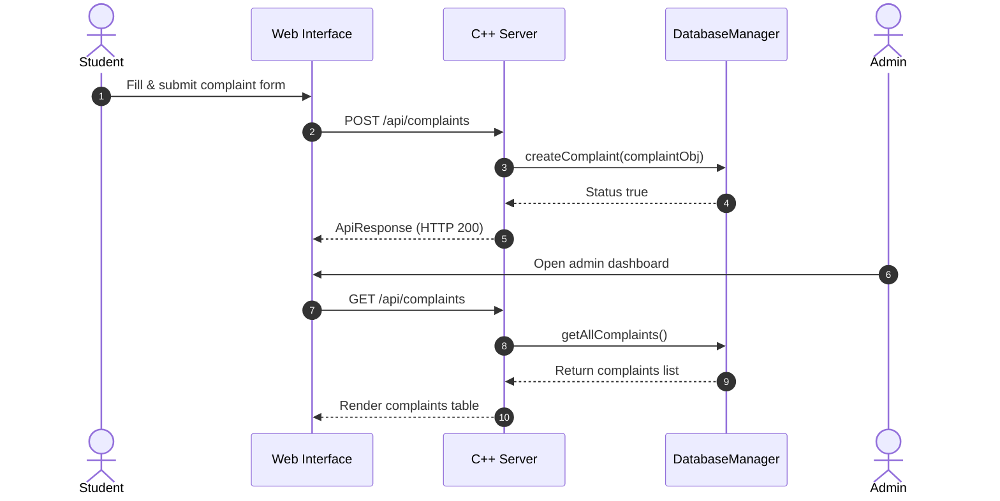

# System Diagrams

## Class Diagram

```mermaid
classDiagram
    class User {
        <<abstract>>
        #int id
        #string name
        #string email
        #string password
        +getId() int
        +getName() string
        +getEmail() string
        +getRole() string
    }

    class Student {
        -string rollNumber
        -string department
        -string hostel
        +getRollNumber() string
        +getDepartment() string
        +getHostel() string
        +getRole() string
    }

    class Admin {
        -string roleTitle
        +getRoleTitle() string
        +getRole() string
    }

    class Complaint {
        -int id
        -string studentEmail
        -string category
        -string description
        -string status
        -string priority
        +getId() int
        +getStudentEmail() string
        +getCategory() string
        +getDescription() string
        +getStatus() string
        +getPriority() string
        +setStatus(string s) void
        +toJSON() string
    }

    class ApiResponse {
        -bool success
        -string message
        +isSuccess() bool
        +getMessage() string
    }

    class DatabaseManager {
        -string host
        -string user
        -string pass
        -string dbName
        +registerStudent(Student s) bool
        +authenticateUser(string u, string p) string
        +createComplaint(Complaint c) bool
        +getAllComplaints() vector
        +updateComplaintStatus(int id, string s) bool
    }

    User <|-- Student
    User <|-- Admin
    DatabaseManager ..> Student
    DatabaseManager ..> Admin
    DatabaseManager ..> Complaint
    DatabaseManager ..> ApiResponse
```

## Architecture Diagram

```mermaid
flowchart LR
    subgraph Frontend ["Presentation Layer"]
        UI["Web Interface (HTML/CSS/JS)"]
        SV["Student Dashboard"]
        AV["Admin Dashboard"]
        UI --> SV
        UI --> AV
    end

    subgraph Backend ["C++ Backend"]
        R["HTTP Router (httplib)"]
        M["OOP Models (User, Complaint)"]
        RES["ApiResponse"]
        DB["DatabaseManager"]

        R --> M
        R --> RES
        M --> DB
    end

    subgraph DB_Layer ["Database Layer"]
        SQL[("MySQL Database")]
    end

    Frontend --> R
    DB --> SQL
```

## Sequence Diagram

```mermaid
sequenceDiagram
    autonumber
    actor S as Student
    participant FE as Web Interface
    participant BE as C++ Server
    participant DB as DatabaseManager
    actor A as Admin

    S->>FE: Fill & submit complaint form
    FE->>BE: POST /api/complaints
    BE->>DB: createComplaint(complaintObj)
    DB-->>BE: Status true
    BE-->>FE: ApiResponse (HTTP 200)

    A->>FE: Open admin dashboard
    FE->>BE: GET /api/complaints
    BE->>DB: getAllComplaints()
    DB-->>BE: Return complaints list
    BE-->>FE: Render complaints table
```
